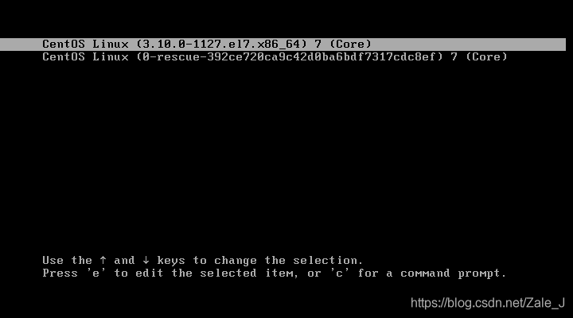

## 启动选项
在虚拟机安装centos 7 服务器，启动的时候有2个选项

第一个选项是正常启动，第二个选项是修复模式，也就是系统有问题的时候再选。

## linux 远程登录
1. Linux 系统中是通过 ssh 服务实现的远程登录功能，默认 ssh 服务端口号为 22。

2. mac远程登录linux(以虚拟机为例)：
iTerm 2 命令行  `ssh root@ip地址` 会车即可

### linux查看ip：`config | ip addr`

### centos7 ifconfig command not fount的解决办法：
https://blog.csdn.net/ryu2003/article/details/78492127

### centos 7 vi放弃修改文件的办法：
esc 推出编辑模式：
:q! 不保存推出

## Linux 重启命令：
reboot

## linux 文件系统：
linux是典型的文件系统，不同用户有不用的文件权限
修改文件或目录权限的命令：
chown (change ownrep): 修改所属用户与组。
chomd (change mode): 修改用户的权限

`ll 或 ls -l 命令来显示文件属性`
```shell
[root@www /]# ls -l
total 64
dr-xr-xr-x   2 root root 4096 Dec 14  2012 bin
dr-xr-xr-x   4 root root 4096 Apr 19  2012 boot
……
```
第一个字符代表这个文件是目录、文件或链接文件等:
d: 目录
-: 文件
l: 链接文档(link file)
b: 装置文件里面的可供储存的接口设备(可随机存取装置)；
c: 装置文件里面的串行端口设备，例如键盘、鼠标(一次性读取装置)。

接下来的字符中，三个为一组，切均为rwx的三个参数的组合。 
r: 可读(read), w: 可写(write), x: 可执行(execute)。 三个权限的位置不会变，没有权限用'-' 表示

每个文件的属性由左边第一部分的 10 个字符来确定（如下图）。


从左至右用 0-9 这些数字来表示。

第 0 位确定文件类型，第 1-3 位确定属主（该文件的所有者）拥有该文件的权限。

第4-6位确定属组（所有者的同组用户）拥有该文件的权限，第7-9位确定其他用户拥有该文件的权限。
其中，第 1、4、7 位表示读权限，如果用 r 字符表示，则有读权限，如果用 - 字符表示，则没有读权限；

第 2、5、8 位表示写权限，如果用 w 字符表示，则有写权限，如果用 - 字符表示没有写权限；第 3、6、9 位表示可执行权限，如果用 x 字符表示，则有执行权限，如果用 - 字符表示，则没有执行权限。

### linux文件属主和属组
```shell
[root@www /]# ls -l
total 64
# 第一个root代表用户 第二个root代表用户组
dr-xr-xr-x   2 root root 4096 Dec 14  2012 bin
dr-xr-xr-x   4 root root 4096 Apr 19  2012 boot
……
```

对于文件来说，它都有一个特定的所有者，也就是对该文件具有所有权的用户。
同时，在Linux系统中，用户是按组分类的，一个用户属于一个或多个组。
文件所有者以外的用户又可以分为文件所有者的同组用户和其他用户。
因此，Linux系统按文件所有者、文件所有者同组用户和其他用户来规定了不同的文件访问权限。
在以上实例中，mysql 文件是一个目录文件，属主和属组都为 mysql，属主有可读、可写、可执行的权限；与属主同组的其他用户有可读和可执行的权限；其他用户也有可读和可执行的权限。
对于 root 用户来说，一般情况下，文件的权限对其不起作用。

### 更改文件属性：
1. chgrp 更改文件属组
`chgrp [-R] 属组名 文件名`
-R：递归更改文件属组

2. chown 更改文件所属用户和组别
```shell
chown [–R] 属主名 文件名
chown [-R] 属主名：属组名 文件名
```
进入 /root 目录（~）将install.log的拥有者改为bin这个账号：
```
[root@www ~] cd ~
[root@www ~]# chown bin install.log
[root@www ~]# ls -l
-rw-r--r--  1 bin  users 68495 Jun 25 08:53 install.log
```
将install.log的拥有者与群组改回为root：
```
[root@www ~]# chown root:root install.log
[root@www ~]# ls -l
-rw-r--r--  1 root root 68495 Jun 25 08:53 install.log
```

3. chmod: 更改文件9个属性：
Linux文件属性有两种设置方法，一种是数字，一种是符号。
Linux 文件的基本权限就有九个，分别是 owner/group/others(拥有者/组/其他) 三种身份各有自己的 read/write/execute 权限。
先复习一下刚刚上面提到的数据：文件的权限字符为： -rwxrwxrwx ， 这九个权限是三个三个一组的！其中，我们可以使用数字来代表各个权限，各权限的分数对照表如下：
r:4
w:2
x:1
每种身份(owner/group/others)各自的三个权限(r/w/x)分数是需要累加的，例如当权限为： -rwxrwx--- 分数则是：
owner = rwx = 4+2+1 = 7
group = rwx = 4+2+1 = 7
others= --- = 0+0+0 = 0
所以等一下我们设定权限的变更时，该文件的权限数字就是 770。变更权限的指令 chmod 的语法是这样的：
`chmod [-R] xyz 文件或目录`
选项与参数：
xyz : 就是刚刚提到的数字类型的权限属性，为 rwx 属性数值的相加。
-R : 进行递归(recursive)的持续变更，亦即连同次目录下的所有文件都会变更
举例来说，如果要将 .bashrc 这个文件所有的权限都设定启用，那么命令如下：
```
[root@www ~]# ls -al .bashrc
-rw-r--r--  1 root root 395 Jul  4 11:45 .bashrc
[root@www ~]# chmod 777 .bashrc
[root@www ~]# ls -al .bashrc
-rwxrwxrwx  1 root root 395 Jul  4 11:45 .bashrc
```
那如果要将权限变成 -rwxr-xr-- 呢？那么权限的分数就成为 [4+2+1][4+0+1][4+0+0]=754。

符号类型改变文件权限
还有一个改变权限的方法，从之前的介绍中我们可以发现，基本上就九个权限分别是：

user：用户
group：组
others：其他
那么我们就可以使用 u, g, o 来代表三种身份的权限。

此外， a 则代表 all，即全部的身份。读写的权限可以写成 r, w, x，也就是可以使用下表的方式来看：

| | | | | |
| ---- | ---- | ---- | ---- | ---- |
| chmod	| u | +(加入) | r | 文件或目录 |
||g   | -(除去) | w | |
||o|=(设定)	|x
||a

如果我们需要将文件权限设置为 -rwxr-xr-- ，可以使用 chmod u=rwx,g=rx,o=r 文件名 来设定:
```
#  touch test1    // 创建 test1 文件
# ls -al test1    // 查看 test1 默认权限
-rw-r--r-- 1 root root 0 Nov 15 10:32 test1
# chmod u=rwx,g=rx,o=r  test1    // 修改 test1 权限
# ls -al test1
-rwxr-xr-- 1 root root 0 Nov 15 10:32 test1
```
而如果是要将权限去掉而不改变其他已存在的权限呢？例如要拿掉全部人的可执行权限，则：
```
#  chmod  a-x test1
# ls -al test1
-rw-r--r-- 1 root root 0 Nov 15 10:32 test1
```

## linux文件与目录管理
ls (list files): 列出目录及文件名
cd (change directory): 切换目录
pwd (print work directory): 显示当前的目录
mkdir (make directory): 创建一个新的目录
rmdir (remove directory): 删除一个空的目录
cp (copy file): 复制文件或目录
rm (remove): 移动文件或目录
mv (move file): 移动文件与目录，或修改文件与目录的名称
你可以使用 man [命令] 来查看各个命令的使用文档，如 ：man cp。

* ls 参数
-a: 全部文件,包含隐藏文件
-d: 仅列出目录本身，而不是列出目录内的文件数据(常用)
-l: 长数据串列出，包含文件的属性与权限等等数据；(常用)

* rm
`rm [-fir] 文件或目录`
-f: force,忽略不存在的文件
-i: 互动模式，在删除前会询问使用者是否动作
-r ：递归删除啊！最常用在目录的删除了！这是非常危险的选项！！！

* mv(移动文件与目录，或修改名称)
```
mv [-fiu] source destination
mv [options] source1 source2 source3 .... directory
```
参数：
-f：force 强制的意思，如果目标文件已经存在，不会询问而直接覆盖；
-i ：若目标文件 (destination) 已经存在时，就会询问是否覆盖！
-u ：若目标文件已经存在，且 source 比较新，才会升级 (update)

### linux文件内容查看：
cat  由第一行开始显示文件内容
tac  从最后一行开始显示，可以看出 tac 是 cat 的倒着写！
nl   显示的时候，顺道输出行号！
more 一页一页的显示文件内容
less 与 more 类似，但是比 more 更好的是，他可以往前翻页！
head 只看头几行
tail 只看尾巴几行


----------
## Q && A
1. q: linux切换用户:
su username

2. q: '~' 与 '/' 目录的区别：
~表示当前用户目录, 用户root登录则目录为/root ,用户jack登录则为/home/jack
/表示根目录。如：root下为 /，jack下也是/

3. 终端中，命令提示符#和$区别
    ```shell
    [wlz@localhost /]$
    [root@localhost /]#
    ```
    只有root用户的命令提示符是#，其他用户的命令提示符都为$

4. init命令
    1. init进程，它是一个由内核启动的用户级进程。
        内核自行启动（已经被载入内存，开始运行，并已初始化所有的设备驱动程序和数据结构等）之后，就通过启动一个用户级程序init的方式，完成引导进程。所以,init始终是第一个进程（其进程编号始终为1）。
        　　内核会在过去曾使用过init的几个地方查找它，它的正确位置（对Linux系统来说）是/sbin/init。如果内核找不到init，它就会试着运行/bin/sh，如果运行失败，系统的启动也会失败。
    2. init一共分为7个级别，这7个级别的所代表的含义如下
        ```shell
        #init 0 - 停机（千万不能把initdefault 设置为0 ）

        #init 1 - 单用户模式，只root用户进行维护

        #init 2 - 多用户，不能使用NFS(Net File System) 不联网

        #init 3 - 完全多用户模式(标准的运行级)

        #init 4 - 安全模式

        #init 5 - X11 （xwindow) 图形化界面模式

        #init 6 - 重新启动 （千万不要把initdefault 设置为6 ）
        ```
    3. 开机默认模式设置方式 
    当我们已界面模式退出后，再次开机进入时，还是界面模式，我们想不管我们以什么模式退出，在每次开机进入时默认是命令行模式，该如何设置呢？ 
    方法如下：在CentOS系统下有个跟文件目录：/etc/inittab
    ```shell
    # inittab       This file describes how the INIT process should set up
    #               the system in a certain run-level.
    #
    # Author:       Miquel van Smoorenburg, <miquels@drinkel.nl.mugnet.org>
    #               Modified for RHS Linux by Marc Ewing and Donnie Barnes
    #
    # Default runlevel. The runlevels used by RHS are:
    #   0 - halt (Do NOT set initdefault to this)
    #   1 - Single user mode
    #   2 - Multiuser, without NFS (The same as 3, if you do not have networking)
    #   3 - Full multiuser mode
    #   4 - unused
    #   5 - X11
    #   6 - reboot (Do NOT set initdefault to this)
    #
    id:3:initdefault:
    ```
    看第16行的代码，这里可以设置默认启动模式，如果设置为 id:3:initdefault: 这代表默认启动为命令行模式。如果设置为 id:5:initdefault: 这代表默认戚东卫图形化界面模式。
    注意：万万不能把默认设为0或者6。因为0代表关机，6代表重启。如果设置为这两个中的其中一个，就会反复地关机和重启。切记！
    说明：#代表单行注释

5. linux wget未找到命令
应为wget没安装 需要先安装：
`yum -y install wget`

6. ps 命令
ps (process status): 用于显示当前进程的状态
`ps [options] [--help]`
参数：
-A 列出所有的进程
-w 显示加宽可以显示较多的资讯
-au 显示较详细的资讯
-aux 显示所有包含其他使用者的行程
au(x) 输出格式 :
USER PID %CPU %MEM VSZ RSS TTY STAT START TIME COMMAND
USER: 行程拥有者
PID: pid
%CPU: 占用的 CPU 使用率
%MEM: 占用的记忆体使用率
VSZ: 占用的虚拟记忆体大小
RSS: 占用的记忆体大小
TTY: 终端的次要装置号码 (minor device number of tty)
STAT: 该行程的状态:
D: 无法中断的休眠状态 (通常 IO 的进程)
R: 正在执行中
S: 静止状态
T: 暂停执行
Z: 不存在但暂时无法消除
W: 没有足够的记忆体分页可分配
<: 高优先序的行程
N: 低优先序的行程
L: 有记忆体分页分配并锁在记忆体内 (实时系统或捱A I/O)
START: 行程开始时间
TIME: 执行的时间
COMMAND:所执行的指令

