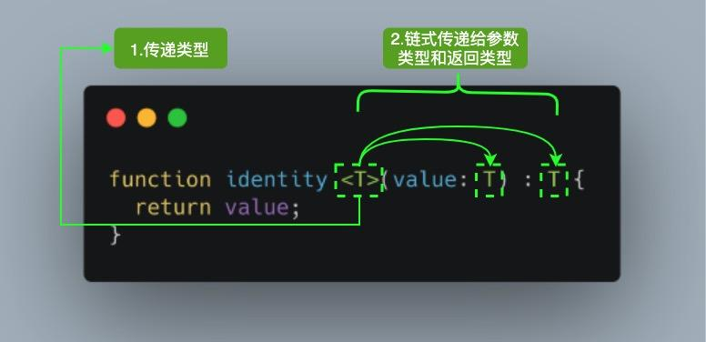

# typescript

qa:
typescript 如何定义类？
ts 泛型？

## ts安装与编译
1. 安装ts
```shell
npm install -g typescript
# 看到版本号即说明安装成功
tsc -v # Version 4.0.2
```
2. 编译ts文件
本地：
```shell
tsc helloworld.ts
# helloworld.ts => helloworld.js
```
在线编译：
[TypeScript Playground](https://www.typescriptlang.org/play)

3. 典型 TypeScript 工作流程


## typescript类型

### Enum 枚举类型
1. 数字枚举：枚举类型的默认值从0开始递增
```ts
enum Direction {
    NORTH,
    SOUTH,
    EAST,
    WEST,
}
```
编译后：
```js
var Direction;
(function (Direction) {
    Direction[Direction["North"] = 0] = "North";
    Direction[Direction["South"] = 1] = "South";
    Direction[Direction["East"] = 2] = "East";
    Direction[Direction["West"] = 3] = "West";
})(Direction || (Direction = {}));
var dir = Direction.North;
```
2. 字符串枚举
```ts
enum Direction {
  NORTH = "NORTH",
  SOUTH = "SOUTH",
  EAST = "EAST",
  WEST = "WEST",
}
```
3. 常量枚举
```ts
const enum Direction {
  NORTH,
  SOUTH,
  EAST,
  WEST,
}

let dir: Direction = Direction.NORTH;
```

### any 类型
在 TypeScript 中，任何类型都可以被归为 any 类型。这让 any 类型成为了类型系统的顶级类型（也被称作全局超级类型）。
```ts
let notSure: any = 666;
notSure = "semlinker";
notSure = false;
```
ts允许我们对 any 类型的值执行任何操作，而无需事先执行任何形式的检查。
如果我们使用 any 类型，就无法使用 TypeScript 提供的大量的保护机制。为了解决 any 带来的问题，TypeScript 3.0 引入了 unknown 类型。

### unknown 类型
就像所有类型都可以赋值给 any，所有类型也都可以赋值给 unknown。这使得 unknown 成为 TypeScript 类型系统的另一种顶级类型（另一种是 any）
```ts
let value: unknown;

value = true; // OK
value = 42; // OK
value = "Hello World"; // OK
value = []; // OK
value = {}; // OK
value = Math.random; // OK
value = null; // OK
value = undefined; // OK
value = new TypeError(); // OK
value = Symbol("type"); // OK
```
对 value 变量的所有赋值都被认为是类型正确的。但是，unknown 类型只能被赋值给 any 类型和 unknown 类型本身。

```ts
let value: unknown;

value.foo.bar; // Error
value.trim(); // Error
value(); // Error
new value(); // Error
value[0][1]; // Error
```
将 value 变量类型设置为 unknown 后，这些操作都不再被认为是类型正确的。
通过将 any 类型改变为 unknown 类型，我们已将允许所有更改的默认设置，更改为禁止任何更改。

### Tuple 元组类型
就是元素类型不一样的数组
```ts
let tupleType: [string, boolean];
tupleType = ["semlinker", true];
```
赋值与申明的类型不一致时会报错

### void 类型
void 类型像是与 any 类型相反，它表示没有任何类型。一般用来表示函数没有返回值。
声明一个 void 类型的变量没有什么作用，因为在严格模式下，它的值只能为 undefined。

### null和undefined
TypeScript 里，undefined 和 null 两者有各自的类型分别为 undefined 和 null。
```ts
let u: undefined = undefined;
let n: null = null;
```

### object,Object和{}类型
1. object 非原始类型
```ts
// node_modules/typescript/lib/lib.es5.d.ts
interface ObjectConstructor {
  create(o: object | null): any;
  // ...
}

const proto = {};

Object.create(proto);     // OK
Object.create(null);      // OK
Object.create(undefined); // Error
Object.create(1337);      // Error
Object.create(true);      // Error
Object.create("oops");    // Error
```
2. Object
所有 Object 类的实例的类型

3. {}
{} 类型描述了一个没有成员的对象。当你试图访问这样一个对象的任意属性时，TypeScript 会产生一个编译时错误。
```ts
// Type {}
const obj = {};

// Error: Property 'prop' does not exist on type '{}'.
obj.prop = "semlinker";
```

### Never 类型
never 类型表示的是那些永不存在的值的类型。 
例如，never 类型是那些总是会抛出异常或根本就不会有返回值的函数表达式或箭头函数表达式的返回值类型。
```ts
function error(message: string): never {
    throw new Error(message)
}

function infiniteLoop(): never {
  while (true) {}
}
```
在 TypeScript 中，可以利用 never 类型的特性来实现全面性检查
```ts
type Foo = string | number;

function controlFlowAnalysisWithNever(foo: Foo) {
  if (typeof foo === "string") {
    // 这里 foo 被收窄为 string 类型
  } else if (typeof foo === "number") {
    // 这里 foo 被收窄为 number 类型
  } else {
    // foo 在这里是 never
    const check: never = foo;
  }
}
注意在 else 分支里面，我们把收窄为 never 的 foo 赋值给一个显示声明的 never 变量。如果一切逻辑正确，那么这里应该能够编译通过。但是假如后来有一天你的同事修改了 Foo 的类型：

type Foo = string | number | boolean;

```
然而他忘记同时修改 controlFlowAnalysisWithNever 方法中的控制流程，这时候 else 分支的 foo 类型会被收窄为 boolean 类型，导致无法赋值给 never 类型，这时就会产生一个编译错误。通过这个方式，我们可以确保
controlFlowAnalysisWithNever 方法总是穷尽了 Foo 的所有可能类型。 通过这个示例，我们可以得出一个结论：使用 never 避免出现新增了联合类型没有对应的实现，目的就是写出类型绝对安全的代码。

## ts断言

### 类型断言
有时候你会遇到这样的情况，你会比 TypeScript 更了解某个值的详细信息。通常这会发生在你清楚地知道一个实体具有比它现有类型更确切的类型。
通过类型断言这种方式可以告诉编译器，“相信我，我知道自己在干什么”。类型断言好比其他语言里的类型转换，但是不进行特殊的数据检查和解构。它没有运行时的影响，只是在编译阶段起作用。
类型断言有两种形式：
1. “尖括号” 语法
```ts
let someValue: any = "this is a string";
let strLength: number = (<string>someValue).length;
```
2. as 语法
```ts
let someValue: any = "this is a string";
let strLength: number = (someValue as string).length;
```

### 非空断言
在上下文中当类型检查器无法断定类型时，一个新的后缀表达式操作符 ! 可以用于断言操作对象是非 null 和非 undefined 类型。具体而言，x! 将从 x 值域中排除 null 和 undefined 。


## ts接口
接口：对行为的抽象，而具体如何行动需要由类去实现。
TypeScript 中的接口是一个非常灵活的概念，除了可用于对类的一部分行为进行抽象以外，也常用于对「对象的形状（Shape）」进行描述。
在TypeScript里，接口的作用就是为这些类型命名和为你的代码或第三方代码定义契约。
### 1. 对象的形状
```ts
interface Person {
    name: string;
    age: number;
}

let semlinker: Person = {
    name: 'semlinker',
    age: 18
}
```
### 2. 可读 | 只选属性
```ts
interface Person {
    readonly name: string;
    age?: number;
}
```
只读属性用于限制只能在对象刚刚创建的时候修改其值。
此外 TypeScript 还提供了 ReadonlyArray<T> 类型，它与 Array<T> 相似，只是把所有可变方法去掉了，因此可以确保数组创建后再也不能被修改。
```ts
let a:number[] = [1,2,3]
let ro: ReadonlyArray<number> = a;
ro[0] = 12; // error
ro.push(5) // error
a.push('sb')
```

### 3. 任意属性
有时候我们希望一个接口中除了包含必选和可选属性之外，还允许有其他的任意属性，这时我们可以使用 索引签名 的形式来满足上述要求。
```ts
interface Person {
  name: string;
  age?: number;
  [propName: string]: any;
}

const p1 = { name: "semlinker" };
const p2 = { name: "lolo", age: 5 };
const p3 = { name: "kakuqo", sex: 1 }
```

### 4. 接口interface与类型别民type的区别

1. 都可以描述 Object/Function
interface:
```ts
interface Point {
    x: number;
    y: number;
}
interface setPoint {
    (x:number, y:number): void;
}
```

type:
```ts
type Point = {
    x: number;
    y: number;
}
type setPoint = (x:number; y:number) => void;
```

2. type还可用于其他类型，如原始类型、联合类型和元组
```ts
type Name = string;

// object
type PartialPointX = { x: number; };
type PartialPointY = { y: number; };

// union
type PartialPoint = PartialPointX | PartialPointY;

type Data = [number, string];
```

## ts范型

### 范型语法
软件工程中，我们不仅要创建一致的定义良好的API，同时也要考虑可重用性。 组件不仅能够支持当前的数据类型，同时也能支持未来的数据类型，这在创建大型系统时为你提供了十分灵活的功能。

在像C#和Java这样的语言中，可以使用泛型来创建可重用的组件，一个组件可以支持多种类型的数据。 这样用户就可以以自己的数据类型来使用组件。
设计泛型的关键目的是在成员之间提供有意义的约束，这些成员可以是：类的实例成员、类的方法、函数参数和函数返回值。
泛型（Generics）是允许同一个函数接受不同类型参数的一种模板。相比于使用 any 类型，使用泛型来创建可复用的组件要更好，因为泛型会保留参数类型。
T 即type的意思
如下，设置了一个范型，使函数接收的参数类型和返回类型是同一个类型，假如使用any,不能保证参数和返回值的类型一致。
```ts
function identity<T>(arg: T): T {
    return arg;
}
```

参考上面的图片，当我们调用  identity<Number>(1) ，Number 类型就像参数 1 一样，它将在出现 T 的任何位置填充该类型。图中 <T> 内部的 T 被称为类型变量，它是我们希望传递给 identity 函数的类型占位符，同时它被分配给 value 参数用来代替它的类型：此时 T 充当的是类型，而不是特定的 Number 类型。

可以引入希望定义的任何数量的类型变量。比如我们引入一个新的类型变量 U，用于扩展我们定义的 identity 函数
```ts
function identity <T, U>(value: T, message: U) : T {
  console.log(message);
  return value;
}

console.log(identity<Number, string>(68, "Semlinker"));
```

### 范型接口
```ts
interface GenericIdentityFn<T> {
    (arg: T): T;
}
```

### 范型类
```ts
class GenNumber<T> {
    zeroValue: T;
    add: (x: T, y:T) => T;
}

let myGen = new GenNumber<number>();
myGen.zeroValue = 0;
myGen.add = function (x, y) {
  return x + y;
};
```

## ts装饰器
1. 装饰器是什么
它是一个表达式
该表达式被执行后，返回一个函数
函数的入参分别为 target、name 和 descriptor
执行该函数后，可能返回 descriptor 对象，用于配置 target 对象

2. 装饰器的分类
类装饰器 Class decorators
属性装饰器 Property decorators
方法装饰器 Method decorators
参数装饰器 Parameter decorators

需要注意的是，若要启用实验性的装饰器特性，你必须在命令行或 tsconfig.json 里启用 experimentalDecorators 编译器选项：
命令行：
`tsc --target ES5 --experimentalDecorators`
```
tsconfig.json
```json
{
  "compilerOptions": {
     "target": "ES5",
     "experimentalDecorators": true
   }
}
```

3. 类装饰器
```ts
declare type ClassDecorator = <TFunction extends Function>(taget: TFunction) => TFunction | void;
```
类装饰器顾名思义，就是用来装饰类的。它接收一个参数：
target: TFunction - 被装饰的类
eg:
```ts
function Greeter(target: Function): void {
  target.prototype.greet = function (): void {
    console.log("Hello Semlinker!");
  };
}

@Greeter
class Greeting {
  constructor() {
    // 内部实现
  }
}

let myGreeting = new Greeting();
(myGreeting as any).greet(); // console output: 'Hello Semlinker!';
```
上面的例子中，我们定义了 Greeter 类装饰器，同时我们使用了 @Greeter 语法糖，来使用装饰器。